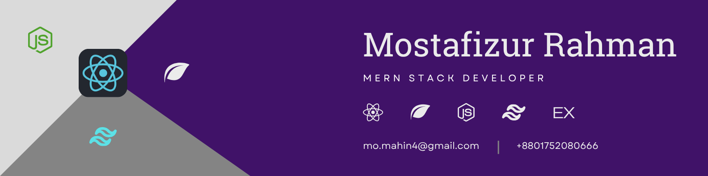

<!--- banner --->

 

<!--- title --->

  <ul align="center">
    
<h1 style="display: inline-block">Hi 👋, I'm Mostafizur Rahman Mahin</h1>

    
  </ul>

 

<!--- about --->
- 👋 Hi, I’m **[@Mostafiz002](https://github.com/Mostafiz002)**
- 🖥️ I build full-stack projects using the **MERN stack (MongoDB, Express.js, React.js, Node.js)**.
- 🎨 I love creating clean UI and smooth user experiences with **React.js & Tailwind CSS**.
- 🗄️ I build efficient APIs using **Node.js, Express.js & MongoDB**.
- 🌱 Currently learning **advanced MERN patterns, authentication, and optimization**.
- 💬 Ask me about **JavaScript, MERN Stack, REST APIs, React.js, Node.js**.
- 📫 Reach me anytime: **mo.mahin4@gmail.com**

 

<!--- socials --->
## <b> CONNECT WITH ME:</b>

  

    
    
    
    
    
  

 

<!--- technology --->
## <b> TECHNOLOGY STACK:</b>

### Languages:

### Frontend:

### Backend:

### Database:

### Tools:

### Deployment:

### Others:

 

<!--- statistics --->
## <b> GITHUB STATISTICS:</b>

### GitHub Contributions:

### GitHub Statistics:
|  |  |
| ------------- | ------------- |

### Stats:

 <!-- Activity Graph -->
  

 

<!--- random quote --->
## <b> RANDOM DEV QUOTE:</b>

 

## My Projects:
Check the pinned repositories below 👇

 
  

