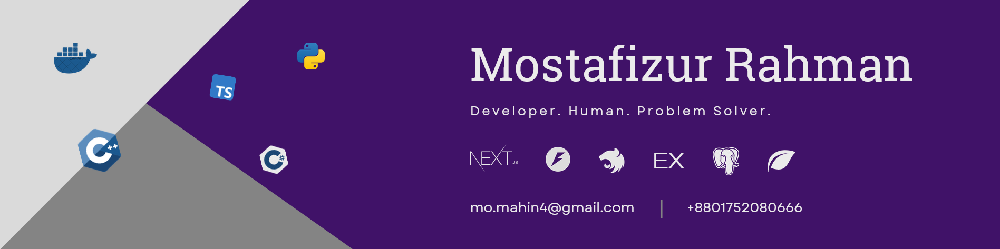

<!--- banner --->

 

<!--- title --->

  <ul align="center">
    
<h1 style="display: inline-block">Hi 👋, I'm Mostafizur Rahman Mahin</h1>

    
  </ul>

 

<table>
<tr>
<td width="65%">

Driven MERN Stack Developer and CSE student, passionate about solving complex problems through technology. Proven track record
of developing secure, responsive applications with React, Node.js, and PostgreSQL/MongoDB. Eager to leverage my expertise in API
security, role-based access control, and real-time synchronization to contribute to impactful, real-world digital solutions.

- Working toward developing advanced full-stack skills
- 📫 Reach me anytime: **mo.mahin4@gmail.com**

</td>
<td width="35%" align="center">

<!-- Professional Developer GIF -->

</td>
</tr>
</table>

 

<!--- socials --->
## <b> CONNECT WITH ME:</b>

<table>
  <tr>
    <td>
      
    </td>
    <td>
      
    </td>
    <td>
      
    </td>
  </tr>
</table>

 

<!--- technology --->
## <b> TECHNOLOGY STACK:</b>

| Category | Modern Tech Stack |
| :--- | :--- |
| **Languages** |     |
| **Frontend** |       |
| **Backend** |        |
| **Database Architecture** |      |
| **FinTech** |    |
| **Tools & DevOps** |      |
| **CMS & Design** |    |

 

<!--- statistics --->
## <b> MY PROJECTS:</b>

Check the pinned repositories below 👇

 
  

 

